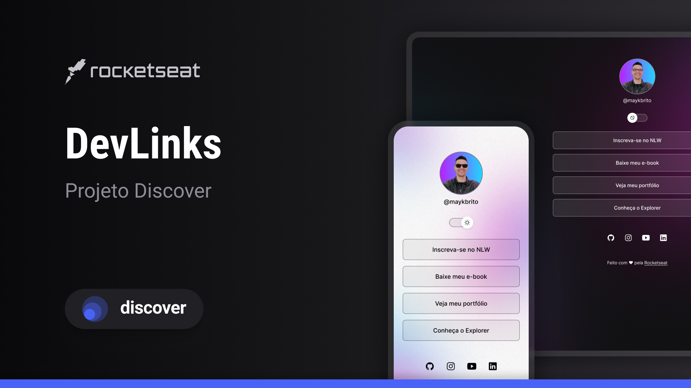

  <h1 align="center"> DevLinks</h1>

Programa exclusivo e gratuito, promovido pela Rocketseat para ensino de tecnologias WEB.

  <a href="#-tecnologias">Tecnologias</a>&nbsp;&nbsp;&nbsp;|&nbsp;&nbsp;&nbsp;
  <a href="#-projeto">Projeto</a>&nbsp;&nbsp;&nbsp;|&nbsp;&nbsp;&nbsp;
  <a href="#-layout">Layout</a>&nbsp;&nbsp;&nbsp;|&nbsp;&nbsp;&nbsp;
  <a href="#memo-licença">Licença</a>

  

 

  

## 🚀 Tecnologias

Esse projeto foi desenvolvido com as seguintes tecnologias:

- HTML e CSS
- JavaScript
- Git e Github
- Figma

## 💻 Projeto

Linktree de Jorge Enrique

Um simples projeto feito com amor e carinho a partir de meu primeiro curso, possível de se encontrar no site da rocketseat.

## 🔖 Layout

Você pode analisar a fonte da minha criação através [desse link] (https://www.figma.com/design/r4jdYiuIIFTwSbzVuIswuJ/DevLinks-%E2%80%A2-Projeto-Discover--Community-?node-id=10-620&p=f&t=y6Xm9VgQo22cnKYE-0). É necessário possuir uma conta no figma para um fácil acesso.
